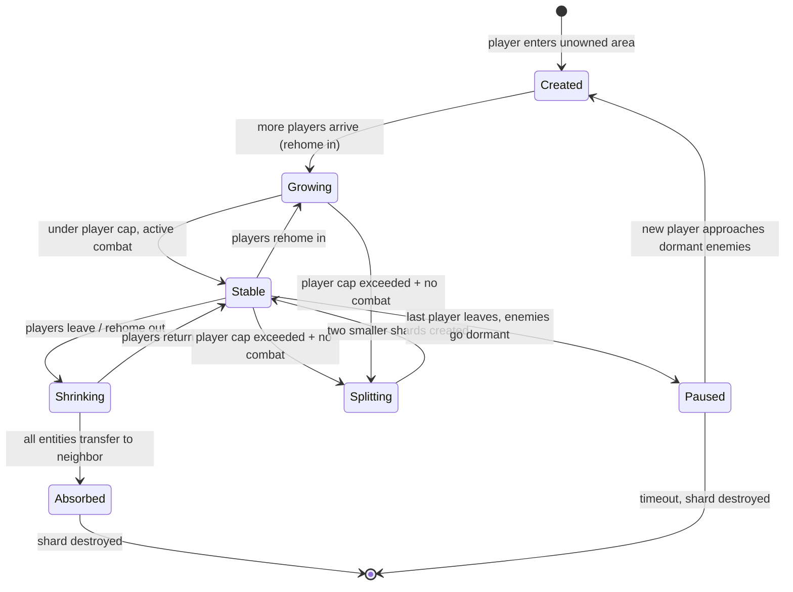

# Zone Sharding & Area of Interest

Seamless world sharding where all players appear to be in one continuous world. Shards are dynamic computational units that follow player clusters, not fixed spatial regions.

## Motivation

A single zone tick broadcasts WorldState to all clients — O(N) packet size, O(N) clients, O(N^2) total bandwidth. At 50 players in one zone at 20 Hz the outbound is ~3.5 MB/s. At 200 players it's ~56 MB/s. Sharding breaks the quadratic cost by partitioning entities across independent simulation units while maintaining the illusion of a single world.

## Core Concepts

### Shard = Entity Cluster

A shard is a Zone goroutine (or process) that owns a dynamic set of entities. It runs the full system pipeline (input, AI, combat, physics, network) for those entities. The shard has no fixed region — its region is wherever its entities are.

```
Shard A owns {P1, P2, E1, E2, E3}     ← players + nearby enemies
Shard B owns {P3, P4, P5, E4, E5}     ← different player cluster

P2 walks toward Shard B's cluster
  → at AOI distance: P2 sees B's entities as ghosts
  → at transfer distance: P2 rehomes to Shard B
  → Shard A keeps a ghost of P2 for its remaining players
```

### Ghost Entities

A ghost is a lightweight, read-only copy of an entity from another shard. Ghosts are included in WorldState so clients see them, but they are excluded from all simulation (no AI, no combat, no input processing). The client cannot distinguish a ghost from a real entity.

### Area of Interest (AOI)

Each shard publishes ghost snapshots for its entities that are near the boundary with another shard's cluster. The AOI radius defines how far beyond the interaction range entities remain visible.

```
60m  AOI radius         ← ghost visible (can see health bar, animations)
40m  Transfer radius    ← automatic rehome to the other shard
 5m  Interaction range  ← already on same shard, combat works normally
```

### Golden Rule: Combat Never Crosses Shard Boundaries

To interact with an entity, you must be on the same shard. You can SEE ghosts but cannot HIT them. When you get close enough to fight (within transfer radius), the coordinator rehomes you to the target's shard first. This eliminates all cross-shard consistency problems — no distributed transactions, no cross-shard damage resolution, no split-brain threat tables.

## AOI Visual Walkthrough

Six snapshots of the same zone over time. The zone is one continuous world — shard boundaries are invisible to clients.

Legend: `P` = player, `E` = enemy, `(A)` = owned by Shard A, `(B)` = owned by Shard B.

### 1. Two Clusters — Two Shards

Two groups of players are far apart. Each shard simulates its own cluster independently. No cross-shard traffic.

```
Zone
+------------------------------------------------------------+
|                                                            |
|   Shard A                                                  |
|   +-----------------+                                      |
|   | P1(A)    P2(A)  |                                      |
|   | E1(A)    E2(A)  |                                      |
|   +-----------------+                                      |
|                                                            |
|                            Shard B                         |
|                            +-----------------+             |
|                            | P3(B)    P4(B)  |             |
|                            | E3(B)    E4(B)  |             |
|                            +-----------------+             |
|                                                            |
+------------------------------------------------------------+
Cross-shard traffic: 0
```

### 2. Player Approaches — AOI Overlap

P2 walks toward Shard B's cluster. When P2 enters the AOI radius, ghosts appear. P2 can now SEE B's entities (health bars, animations) but cannot interact.

```
+------------------------------------------------------------+
|                                                            |
|   Shard A                                                  |
|   +---------------------+                                  |
|   | P1(A)               |                                  |
|   | E1(A)  E2(A)        |                                  |
|   |             P2(A) -------> sees P3 P4 E3 as ghosts     |
|   +---------------------+     (read-only, no combat)       |
|                        :                                   |
|                   AOI  :   Shard B                         |
|                 overlap:   +-----------------+             |
|                        :   | P3(B)    P4(B)  |             |
|                        :   | E3(B)    E4(B)  |             |
|                            +-----------------+             |
|                                                            |
+------------------------------------------------------------+
Cross-shard traffic: ghost snapshots B-->A (~50 bytes/entity x 10 Hz)
```

### 3. Transfer — Player Rehomes

P2 crosses the transfer radius. Coordinator commands Shard A to transfer P2 to Shard B. Full state serialized, sent, adopted. 1-2 ticks (~50-100ms). Client sees nothing.

```
+------------------------------------------------------------+
|                                                            |
|   Shard A (shrunk)                                         |
|   +------------+                                           |
|   | P1(A)      |                                           |
|   | E1(A) E2(A)|                                           |
|   +------------+                                           |
|                                                            |
|                       Shard B (grew)                       |
|                       +----------------------+             |
|                       | P2(B)  P3(B)  P4(B)  |             |
|                       | E3(B)  E4(B)         |             |
|                       +----------------------+             |
|                                                            |
+------------------------------------------------------------+
P2 can now fight E3, E4. P1 sees P2 as a ghost (fed by B-->A).
```

### 4. Clusters Merge — Shard Absorbed

P1 also walks over. Shard A has 0 players near its enemies. Coordinator merges: A's entities transfer to B. Shard A is destroyed.

```
+------------------------------------------------------------+
|                                                            |
|   E1 E2 go dormant (no players nearby, no shard needed)    |
|                                                            |
|                       Shard B (sole shard)                 |
|                       +---------------------------+        |
|                       | P1(B) P2(B) P3(B) P4(B)   |        |
|                       | E3(B) E4(B)               |        |
|                       +---------------------------+        |
|                                                            |
+------------------------------------------------------------+
Shard A: destroyed. Cross-shard traffic: 0.
```

### 5. Shard Splits — Player Cap Exceeded

More players join. Shard B hits the ~50 player cap. Coordinator waits for no active combat, then spatially partitions into two shards by k-means clustering.

```
+------------------------------------------------------------+
|                                                            |
|   Shard B (west)            Shard C (east)                 |
|   +-------------------+    +-------------------+           |
|   | P1 P2 P5 P6 P7    |    | P3 P4 P8 P9 P10   |           |
|   | P11 P12 ... P25   |    | P26 P27 ... P50   |           |
|   | E3 E5 E6          |    | E4 E7 E8          |           |
|   +-------------------+    +-------------------+           |
|                        :  :                                |
|                     AOI overlap                            |
|                  border entities are                       |
|                  ghosts to each other                      |
|                                                            |
+------------------------------------------------------------+
Each shard: ~25 players. AOI ghosts at the boundary seam.
```

### 6. Shard Follows Players — No Fixed Region

Shard B's players all walk north. The shard moves with them. Shard C stays put. New player P51 arrives in the vacated south — coordinator spawns Shard D.

```
+------------------------------------------------------------+
|   Shard B                                                  |
|   +-----------------+    <-- moved north with its players  |
|   | P1 P2 P5 ..     |                                      |
|   | E3 E5 E6        |                                      |
|   +-----------------+                                      |
|                              Shard C                       |
|                              +-----------------+           |
|                              | P3 P4 P8 ..     |           |
|                              | E4 E7 E8        |           |
|                              +-----------------+           |
|                                                            |
|   Shard D                                                  |
|   +-----------------+    <-- new shard for new arrival     |
|   | P51(D)          |                                      |
|   | E1(D) E2(D)     |    <-- dormant enemies reactivated   |
|   +-----------------+                                      |
+------------------------------------------------------------+
Three shards, each following its player cluster. No fixed grid.
```

### Lifecycle State Machine



## Entity Ownership

Every entity in the world is owned by exactly one shard at any given time.

| Entity     | Default Owner                   | Transfers?                                                      |
| ---------- | ------------------------------- | --------------------------------------------------------------- |
| Player     | Assigned shard                  | Yes — rehome when approaching another cluster                   |
| Enemy      | Shard owning their spawn region | Rarely — players come to enemies, not the reverse               |
| NPC        | Shard owning their patrol area  | No                                                              |
| Projectile | Caster's shard                  | No — ghost on other shards (visual only, no cross-shard damage) |

Enemies are spatially anchored (leash radius, patrol routes). When a player approaches an enemy on another shard, the player transfers to the enemy's shard, not the other way around. This keeps enemy AI, threat tables, and phase state stable.

Exception: if a shard's last player leaves and a new player approaches from a different shard, the coordinator may reassign dormant enemies to the incoming player's shard rather than creating a new one.

## Architecture

```
┌─────────────────────────────────────────────────┐
│                   Gateway                        │
│                                                  │
│  ┌──────────────────────────────────────────┐    │
│  │           ShardCoordinator               │    │
│  │                                          │    │
│  │  Spatial index (grid) ← position reports │    │
│  │  Ownership table      ← entity → shard   │    │
│  │  Transfer decisions   → rehome commands   │    │
│  │  Shard lifecycle      → create/destroy    │    │
│  └──────────────────────────────────────────┘    │
│       ▲            ▲            ▲                 │
│       │ Transport  │ Transport  │ Transport       │
│       ▼            ▼            ▼                 │
│   Shard A      Shard B      Shard C              │
│   (Zone)       (Zone)       (Zone)               │
│   {P1,P2,      {P3,P4,     {P5,E6,              │
│    E1,E2}       P5,E3,E4}   E7,E8}              │
└─────────────────────────────────────────────────┘
```

### ShardCoordinator

The coordinator is the orchestrator. It does not simulate anything — it makes assignment decisions.

Responsibilities:

-   Maintain a spatial index mapping positions to shard ownership
-   Receive position reports from all shards each tick
-   Detect proximity conflicts (entities from different shards within transfer radius)
-   Decide transfers: move the fewer entities to the shard with more entities
-   Manage shard lifecycle: create, merge, split, pause

The coordinator runs at a lower frequency than shard ticks (5 Hz is sufficient — transfer decisions don't need per-frame precision).

Today: runs as a goroutine in the gateway process.
Tomorrow: runs as a standalone service that shards connect to.

### Transport Interface

The critical abstraction for horizontal scaling. A shard never directly references another shard's memory. All inter-shard communication goes through Transport.

```
Transport
├── PublishGhosts(snapshots)     high-freq, small payload (~50 bytes/entity)
├── ConsumeGhosts() → snapshots
├── SendTransfer(entity)         low-freq, full state snapshot
├── RecvTransfers() → entities
├── ReportPositions(positions)   coordinator needs this for decisions
└── RecvCommands() → commands    coordinator sends rehome/split commands
```

Implementations:

-   **ChannelTransport** — Go channels, zero serialization. Used when shards are goroutines in the same process.
-   **GRPCTransport** — Protobuf on the wire. Used when shards are separate processes or machines. Same interface, swap at startup.

The shard code is identical in both cases. Only the transport wiring changes.

### Ghost Snapshot

What crosses the shard boundary every tick. Contains enough data to render the entity (position, health bar, animations) but not enough to simulate it (no threat table, no cooldowns, no buff internals).

```
GhostSnapshot {
    entity_type:  u8        player | enemy | npc | projectile
    id:           u16       globally unique within the zone
    position:     Vec3
    rotation_y:   f32
    health:       f32       for health bars
    max_health:   f32
    state:        u8        visual state (attack anim, cast, idle)
    class_or_def: string    "gunner" or "guard_captain"
    username:     string    players only
    visual_state: u8
    remove:       bool      entity left AOI, delete the ghost
}
```

~50-80 bytes per snapshot. At 10 border entities between two shards at 10 Hz: 5-8 KB/s per shard pair. Negligible.

## Shard Tick Sequence

```
processTick():
    ── Pre-tick: consume cross-shard data ──
    1. Drain ghost snapshots from transport → update GhostPlayers/GhostEnemies
    2. Drain entity transfers from transport → adopt into real Players/Enemies
    3. Drain coordinator commands → mark entities for outbound transfer

    ── Standard system pipeline (unchanged) ──
    4. InputSystem.Tick()       ← skips ghost entities
    5. GameFlowSystem.Tick()
    6. AISystem.Tick()          ← skips ghost enemies
    7. CombatSystem.Tick()      ← skips ghost entities
    8. PhysicsSystem.Tick()     ← skips ghost projectiles
    9. NetworkSystem.Tick()     ← includes ghosts in WorldState

    ── Post-tick: publish cross-shard data ──
    10. Publish ghost snapshots for own entities near shard boundaries
    11. Report entity positions to coordinator
    12. Execute pending outbound transfers (snapshot → send → remove)
```

Existing systems are barely touched. Each system gets a single `if entity.IsGhost { continue }` guard on its write path. The read path (WorldState encoding) includes ghosts alongside real entities.

## Transfer Sequence

Player P on Shard A walks toward enemies on Shard B:

```
Tick N:   Coordinator detects P within transfer radius of Shard B's cluster
          → Sends rehome command to Shard A: "transfer P to Shard B"

Tick N+1: Shard A executes transfer-out:
          1. Snapshot P's full state (position, HP, class, gear, buffs,
             cooldowns, resources, ability state, DoTs, combat flags)
          2. Send EntityTransfer{P} to Shard B via Transport
          3. Remove P from Players
          4. P becomes a ghost on A (fed by B's ghost publishes from now on)
          5. Gateway rewires P's session: inputs now route to Shard B

Tick N+2: Shard B executes transfer-in:
          1. Receive EntityTransfer, create real Player from snapshot
          2. Add to Players map, register with Clients
          3. Client receives silent OpZoneTransfer (same zone type, same scene)
          4. P can now fight Shard B's enemies
```

Transfer latency: 1-2 ticks (50-100ms). The client doesn't reload the scene. Movement continues seamlessly.

### Peer ID Strategy

Open-world zones use globally unique peer IDs (allocated by the gateway, not per-zone). The same player keeps the same peer ID across all shard transfers. This means ghosts and real entities share the same ID — the client sees no change.

Arena instances keep zone-local IDs (unchanged, arenas don't shard).

## Shard Lifecycle

| Event                                     | Action                                                              |
| ----------------------------------------- | ------------------------------------------------------------------- |
| Player enters area with no active shard   | Coordinator creates shard, assigns player + nearby dormant enemies  |
| Players cluster together                  | All on same shard, no transfer needed                               |
| Player approaches another shard's cluster | Rehome player at transfer radius                                    |
| Two clusters fully merge                  | Smaller shard's entities transfer to larger. Empty shard destroyed. |
| Shard exceeds player cap (~50)            | Coordinator splits: partition into 2 shards by spatial clustering   |
| Last player leaves area                   | Enemies go dormant (no tick). Shard paused/destroyed.               |
| Shard in active combat                    | Never split. Wait for combat to end.                                |

## Adaptive Tick Rate

Different zone contexts warrant different tick rates. The tick rate is per-zone (per-shard), not global.

| Context                      | Tick Rate | Rationale                              |
| ---------------------------- | --------- | -------------------------------------- |
| Arena instance (5p)          | 20 Hz     | Combat precision, small broadcast      |
| Raid instance (20p)          | 20 Hz     | Combat precision, manageable broadcast |
| Open world shard (combat)    | 20 Hz     | Combat precision                       |
| Open world shard (no combat) | 10 Hz     | No combat, just traversal              |
| Hub shard                    | 10 Hz     | Social zone, no combat                 |

The client receives the tick rate in `OpZoneJoined` and interpolates accordingly.

## Bandwidth Impact

Comparison for 200 players in one open-world zone:

| Approach                                  | Outbound Bandwidth                  |
| ----------------------------------------- | ----------------------------------- |
| No sharding (single zone, 20 Hz)          | ~56 MB/s                            |
| 4 shards of 50, 10 Hz idle / 20 Hz combat | ~3.5 MB/s per shard, ~14 MB/s total |
| 4 shards + AOI filtering (avg 20 visible) | ~1.5 MB/s per shard, ~6 MB/s total  |

Sharding alone is a ~4x improvement. Combined with adaptive tick rate and AOI filtering, ~9x.

## Horizontal Scaling Path

### Phase 1: Single Process (goroutines + channels)

All shards are goroutines in the gateway process. ChannelTransport provides zero-copy, zero-serialization inter-shard communication. Coordinator is a goroutine.

Scaling limit: one machine's CPU and network. Practical limit ~2,000-5,000 concurrent open-world players depending on hardware and network bandwidth.

### Phase 2: Multi-Process (same machine)

Each shard runs as a subprocess. GRPCTransport over Unix domain sockets. Coordinator is a separate process. This isolates GC pressure per shard and allows per-shard resource limits.

Same machine, but shards can be restarted independently and their memory is isolated.

### Phase 3: Multi-Machine (cluster)

Shards run on different machines. GRPCTransport over TCP. Coordinator runs as a k8s service with leader election. Entity transfers include serialized state over the wire.

New concern: ghost snapshot latency adds 1-5ms network RTT. At 10 Hz ghost publishing, this means ghosts are 1-2 frames stale. Acceptable for visual-only entities.

New concern: entity transfer latency increases from 50ms (1 tick) to ~55-60ms (1 tick + network). Still imperceptible.

The transport interface is the only thing that changes between phases. Shard code, coordinator logic, and client code are identical across all three.

## Implementation Phases

| Phase                       | Scope                                                          | Effort | Prerequisites |
| --------------------------- | -------------------------------------------------------------- | ------ | ------------- |
| A: Foundation               | Transport interface, ghost types, coordinator skeleton         | 3 days | —             |
| B: Ghost replication        | Publish/consume ghosts, render in WorldState                   | 2 days | A             |
| C: Entity transfer          | Full state snapshot/restore, seamless rehome, gateway rewiring | 4 days | A, B          |
| D: Coordinator intelligence | Proximity detection, transfer decisions, shard lifecycle       | 4 days | A, B, C       |
| E: Testing                  | Multi-shard combat scenarios, boundary edge cases, load tests  | 4 days | D             |
| F: gRPC transport           | Protobuf definitions, network transport impl, multi-process    | 4 days | E             |

Phases A-E (single process): ~3 weeks.
Phase F (horizontal scaling): +1 week.

Not needed until Phase 2 of the project roadmap (open world zones).

## Risks

| Risk                                                | Severity | Mitigation                                                                                                                                                               |
| --------------------------------------------------- | -------- | ------------------------------------------------------------------------------------------------------------------------------------------------------------------------ |
| Transfer during active combat (mid-attack)          | High     | Freeze entity for 1 tick during transfer. 50ms is imperceptible. Alternatively, buffer the transfer until the current ability resolves.                                  |
| Entity state snapshot misses a field                | High     | Explicit Snapshot/Restore methods on Player and Enemy with exhaustive tests. No reflection, no serialization magic.                                                      |
| Ghost data is 1-2 ticks stale                       | Low      | Acceptable for visual-only entities. Client interpolates.                                                                                                                |
| Coordinator single point of failure                 | Medium   | Stateless — restart recovers from shard position reports within one coordinator tick.                                                                                    |
| Shard split during boss fight                       | Medium   | Never split shards in combat state. Split only idle/traversal shards.                                                                                                    |
| Thundering herd (100 players converge on one point) | Medium   | Cap shard player count. Coordinator refuses transfers past cap. Players see ghosts but can't enter until the area clears. Same solution as real MMOs (WoW layer system). |

## References

Industry implementations and academic work that informed this design:

-   **SpatialOS (Improbable)** — Entity-cluster sharding across multiple "workers", each simulating a dynamic subset of the world. Workers exchange entity authority via a spatial coordinator. Closest production architecture to what we describe here.
-   **EVE Online (CCP)** — Time Dilation (TiDi) approach: rather than sharding, slows simulation when load spikes. Their "brain in a box" rewrite moved per-entity state to independent simulation units. Instructive for the "never split during combat" constraint.
-   **Unreal Engine Network Relevance** — Built-in AOI system: `IsNetRelevantFor()` filters replication per actor based on distance and visibility. The ghost snapshot concept maps directly to Unreal's "dormant" replicated actors.
-   **Photon Server (Exit Games)** — Interest Management system with "interest areas" that subscribe to nearby regions. Their grid-based spatial index with entity publish/subscribe is a proven implementation of the AOI pattern.
-   **GoWorld** — Open-source Go MMO framework with entity migration between "game" processes. Uses a dispatcher process (≈ our ShardCoordinator) that routes entity RPCs and manages ownership transfers. Closest Go reference implementation.
-   **Zinx AOI module** — Lightweight Go networking framework with a grid-based AOI tutorial. Simple spatial hashing approach for interest management.
-   **"Interest Management for Massively Multiplayer Games"** (Boulanger, Kienzle, Verbrugge, 2006) — Academic survey of AOI algorithms: fixed grid, Voronoi, Delaunay, hybrid approaches. Formalizes the terminology and trade-offs between spatial partitioning strategies.
